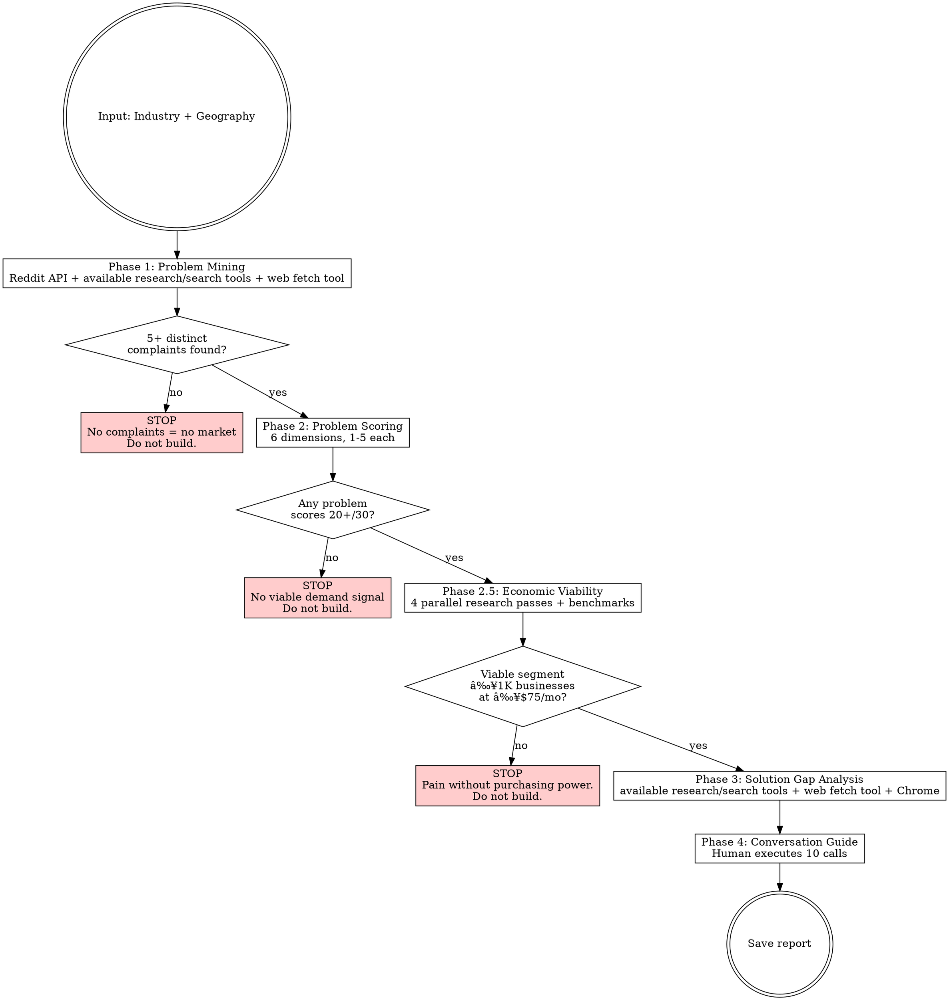

---
name: market-pain
description: Use when researching a new industry vertical before building any product, demo, or outreach campaign. Triggers on "research [industry]", "validate market", "find pain points", "should we build for [industry]", "is there demand", "market-pain", or any time vertical-specific development work is about to begin without prior demand evidence. Also triggers on "compare industries", "which vertical", "best industry", "market-pain compare".
---


## Codex Usage Notes

- Use this as a Codex skill, not a slash command. Trigger from the user request, then follow the workflow in this file.
- Load files from `references/` only when needed. Do not load the entire reference set by default.
- Use available Codex tools for the environment: local filesystem/search tools for repo work, web or browser tools when research or page inspection is required, and exact source capture when evidence is cited.
- Do not spawn delegated agents unless the user explicitly asks for parallel agent work. If delegation is not available or not authorized, perform the passes sequentially in the main context and preserve the same evidence gates.
- When another skill is named, apply that skill's workflow if it is installed in the Codex environment. If it is not installed, continue with the local instructions and state the gap.
# Market Pain Research

## Overview

Find problems people are ALREADY complaining about before building anything. This replaces "pick industry -> map their systems -> build demos -> hope" with "find pain -> score urgency -> verify economics -> verify gap -> THEN build."

**Core rule:** If you can't find complaints, there's no market. A blank Phase 1 is a valid, valuable result — it means don't build here.

**This is a RIGID workflow.** Each phase gates the next. No skipping.

## Reference materials

Deeper material lives in this skill's `references/` folder. Open these alongside the skill on your first run:

- `references/glossary.md` — definitions for MRR, TAM, addressable segment, replacement spend, SWAP vs NEW LINE, moat, kill switch, platform risk, gap durability.
- `references/scoring-rubric.md` — anchored scoring descriptions with worked cases for every dimension in Phase 2 and Phase 4.
- `references/worked-examples.md` — three end-to-end walk-throughs: a clean PROCEED, a high-score KILL, and a Phase 1 kill. Read the first example before your first run.
- `references/industry-tracker-template.md` — copyable tracker schema with examples (full + minimal versions).

## Industry Tracker (optional but recommended)

If you are researching multiple industries, keep a tracker file (e.g. `industry-tracker.md` in your working directory) with: status, scores, outcomes, rankings. Always read it first when this skill is invoked — it tells you what's been done, what's queued, and the current rankings.

See `references/industry-tracker-template.md` for the schema and a working example.

## Input Modes

### Mode 1: Pick an industry (no argument or "pick")

`market-pain` skill or `market-pain pick` skill input

1. Read the tracker (if one exists)
2. Show the user a top-candidates table, marking any already researched
3. Ask: "Which industry do you want to research next? Pick a number, or name one from the full list."
4. Once chosen, proceed to Phase 1

### Mode 2: Research a specific industry

`market-pain [industry] in [geography]` skill input

Example: `market-pain plumbing in australia` skill input

1. Check the tracker to see if this industry has already been researched
2. If already DONE with Phase 2.5: show the existing report summary and ask "Re-run or pick a different one?"
3. If DONE but missing Phase 2.5: say "This report has Phases 1-4 but no economic viability analysis. Running Phase 2.5 now." Skip to Phase 2.5, using the existing Phase 2 scores to identify qualifying problems.
4. If not done: proceed to Phase 1

### Mode 3: Compare completed research

`market-pain compare` skill input

1. Read the tracker and all completed reports
2. Build a comparison matrix across all researched industries:

| Dimension | Industry A | Industry B | Industry C |
|-|-|-|-|
| Top problem score (/30) | | | |
| Market size (businesses) | | | |
| Accessibility (OPEN/MIXED/GATED) | | | |
| Competitor density | | | |
| Gap clarity (HIGH/MED/LOW) | | | |
| Buildability on your stack | | | |
| Price ceiling (target segment) | | | |
| Current software spend | | | |
| Top problem replacement spend | | | |
| Sell type (SWAP/NEW) | | | |
| Viable segment + count | | | |
| MRR at 1% penetration | | | |
| Platform Risk | GREEN/YELLOW/RED | GREEN/YELLOW/RED | GREEN/YELLOW/RED |
| Human validation result | | | |
| Time to first revenue (estimate) | | | |

3. For reports missing Phase 2.5 data: note "ECONOMICS: NOT ASSESSED." Do NOT fill in economic dimensions with guesses — flag them as needing a Phase 2.5 run.
4. Recommend the strongest vertical with rationale
5. If < 3 industries researched, say: "Need at least 3 completed reports for a meaningful comparison. [X] done so far. Pick another industry to research."

## Post-Research Update (MANDATORY if using a tracker)

After EVERY `market-pain` skill run (even kills), update the tracker:

1. Read the tracker
2. Add the industry to the "Completed Research" table with: date, status, top score, top problem, report path, recommendation
3. Remove it from "Queued for Research" if it was there
4. Update top rankings if new data changes the picture (e.g., if a top-ranked industry was killed, move it down)
5. Save the tracker

## Workflow



## Source Access Protocol (applies to ALL phases)

Every source MUST be attempted. Never skip a source because the first method failed.

1. **Try web fetch tool first** — fetch the URL directly for full page content
2. **If robots.txt blocked or empty** — IMMEDIATELY use available browser automation tools to open the URL and extract page content. **Do NOT skip this step.** Many competitor sites, marketplaces, and industry pages block automated access but load fine in a real browser.
3. **If Chrome also fails** — document the failure in the report. Note source as "inaccessible" with reason
4. **Log which method worked** for each source in the Methodology Notes section

### Chrome Fallback is MANDATORY for These Sources

The following source types are frequently robots.txt-blocked or return incomplete data via web fetch/search tools. **Always attempt available browser automation** if the first method returns incomplete results:

- **Competitor product pages** — marketing sites often block scrapers
- **Platform marketplace pages** — essential for complete competitor cataloguing
- **Government benchmark pages** — frequently 403-blocked
- **Industry association member pages** — often behind login walls, but public pages may still block bots
- **Review platforms** — some block automated access
- **Competitor pricing pages** — often dynamically loaded, invisible to web fetch tool

**The rule**: If a URL matters for your analysis and web fetch tool returns less than you'd expect, open it in Chrome. Don't document "inaccessible" without trying Chrome first.

### Reddit JSON API (preferred method for Reddit)

web fetch tool blocks reddit.com. Use Python `requests` via Bash to hit Reddit's free JSON API instead. No auth needed.

**Search within subreddits:**
```python
import requests, json
headers = {'User-Agent': 'market-research/1.0'}
url = 'https://www.reddit.com/r/{subreddit}/search.json?q={query}&restrict_sr=on&sort=relevance&t=all&limit=25'
r = requests.get(url, headers=headers, timeout=10)
posts = r.json()['data']['children']
for p in posts:
    d = p['data']
    # d['title'], d['selftext'], d['score'], d['num_comments'], d['subreddit'], d['permalink']
```

**Search across ALL subreddits:**
```python
url = 'https://www.reddit.com/search.json?q={query}&sort=relevance&t=all&limit=25'
```

**Fetch thread comments (gold for verbatim quotes):**
```python
url = f"https://www.reddit.com{post['data']['permalink']}.json?limit=25&sort=top"
r = requests.get(url, headers=headers, timeout=10)
data = r.json()
# data[0] = post, data[1] = comments
comments = data[1]['data']['children']
for c in comments:
    if c['kind'] == 't1':
        # c['data']['body'], c['data']['score']
```

**Target subreddits per industry type:**
- Trades: r/plumbing, r/electricians, r/HVAC, r/Construction, r/trades
- Healthcare: r/dentistry, r/optometry, r/physicaltherapy, r/medicine
- Professional services: r/Accounting, r/LawFirm, r/RealEstate
- General business: r/smallbusiness, r/Entrepreneur, r/sweatystartup
- Geography-specific: local country / region subreddits, finance + property subs

**Geography note:** Reddit skews US/global. This is fine — operational pain points (missed calls, admin burden, software frustrations) are universal across English-speaking markets. Use global Reddit data as **calibration signal** for problem severity and frequency, not as proof of geography-specific demand. Local validation comes from other sources (local forums, industry groups, Phase 4 calls). Tag Reddit findings as "GLOBAL" in the report when they're not sourced from the target geography.

**Query construction for pain-language:**
- Use `OR` for multiple pain terms: `"missed+calls"+OR+"losing+jobs"+OR+"admin+nightmare"`
- Use `restrict_sr=on` when searching within a subreddit
- Use quotes (`%22`) for exact phrases
- Sort by `relevance` first, then `top` for highest-signal posts
- High-value signals: score 50+, comments 20+, selftext contains workarounds or $ amounts

**Rate limit:** ~60 requests/minute. Batch subreddit searches in a single Bash call with a loop.

**Encoding note:** Reddit posts contain Unicode. Always add `encoding='utf-8'` or pipe through `json.dumps(ensure_ascii=True)` when printing.

### Research Tool Hierarchy (use the RIGHT tool for each data type)

| Data Type | Tier 1 (Perplexity) | Tier 2 (Built-in only) | Tier 3 (Manual) |
|-|-|-|-|
| Forum complaints, verbatim quotes | Reddit JSON API (curl) → save → rg or Select-String-verify | Reddit JSON API (curl) → save → rg or Select-String-verify | User pastes thread text into `evidence/raw/manual-*.md` |
| Finding real source URLs | `available research/search tools` → save URL list | `web search tool` → save result list | User pastes URL list |
| Extracting data from sources | `web fetch tool` → save → rg or Select-String-verify | `web fetch tool` → save → rg or Select-String-verify | User pastes page text into `raw/manual-*.md` |
| Theme discovery (directions only) | `available research/search tools` (search_context_size: high) | `web search tool` query like "what {industry} owners complain about" → fetch top results | User pastes 2-3 forum thread URLs |
| Robots.txt-blocked pages | available browser automation → save | available browser automation → save | User pastes manually |
| Gap analysis, synthesis | model synthesis from `[E:S#]` ledger entries only | Same | Same |

**Banned regardless of tier**:
- `available research/search tools` — cost + unreliability documented across many runs
- Citing from snippets (Perplexity description, web search tool description) without web fetch tool + save + rg or Select-String-verify
- Specific numbers (business count, pricing, market share) tagged anything other than `[E:S#]`

**`available research/search tools` rule**: theme discovery ONLY. Output goes into a working-notes scratch, never into the ledger or report. Anything you'd cite must be re-grounded via `available research/search tools` → web fetch tool → save → rg or Select-String-verify.

### Verified Research Protocol (Evidence Ledger discipline)

Every factual claim in the report follows the **Evidence Ledger Protocol** at `references/evidence-ledger-protocol.md` (this skill's own copy — self-contained). Read it once before Phase 1.

**The three rules:**
1. **Raw-first** — every fetched page saves to `evidence/raw/{type}-{slug}-{date}.{ext}` BEFORE anything is written into the ledger.
2. **rg or Select-String-verify every quote** — after writing a verbatim quote in `evidence/evidence.md`, run `rg` or `Select-String` on the raw file for an 8-12 word substring. Zero matches = hallucinated, delete.
3. **Cite by Source #** — every claim in the report is tagged `[E:S#]` (evidence) or `[I:S#,S#]` (inference) or `[A]` (assumption, excluded from kill switches). No bare URLs in the report body.

**Three-tier hierarchy** (skill auto-detects which tier the user is on):

| Tier | When | Tools | Notes |
|-|-|-|-|
| **1** | Perplexity MCP installed | `available research/search tools` → `web fetch tool` → save → rg or Select-String-verify | `available research/search tools` allowed for theme discovery only; never cite from it |
| **2** | No Perplexity (default for public toolkit users) | `web search tool` → `web fetch tool` → save → rg or Select-String-verify; Reddit via curl + JSON API | Same discipline, more steps |
| **3** | No internet / no MCP | User pastes URLs + page content into `evidence/raw/manual-*.md` | Same rg or Select-String-verify discipline; pasted file IS the raw |

**Hard rules (apply to all tiers):**
- NEVER cite a specific number (business count, revenue, margin %, pricing) without a fetched-and-rg or Select-String-verified source
- NEVER cite from a snippet (Perplexity description, web search tool description) — must web fetch tool + save + rg or Select-String-verify
- If web fetch tool fails on a URL, try available browser automation before marking `[INACCESSIBLE]`
- optional delegated pass quote claims are NOT trusted — main context re-runs `rg` or `Select-String` on each before merging into master ledger
- Forbidden phrases (signal hallucination): "Many users say…", "It's commonly reported…", "Industry studies show…", "Research suggests…", "Most {industry} businesses…". Replace with structured citations per the protocol.

**Kill switches count ledger entries, not vibes.** Phase 1 "≥5 complaints" = ≥5 `[E:S#]` ledger entries with complaint quotes. Phase 2.5 "≥1,000 businesses at ≥$75/mo" = `[E:S#]` source for the count + `[E:S#]` source for the price. `[A]` (assumption) entries do NOT count toward kill switches.

**Pre-gate forbidden-phrase scan** (run BEFORE every kill-switch evaluation, not just before final delivery): rg or Select-String the phase output (and any text feeding the gate decision) for forbidden phrases:

```bash
rg or Select-String -nE "Many users (say|complain)|It's commonly|commonly reported|Industry studies show|Research suggests|Most [a-z]+ (businesses|owners) (do|say|prefer)" {phase_output_file}
```

Any matches MUST be replaced with structured `[E:S#]` citations BEFORE the kill-switch evaluates. A claim containing a forbidden phrase cannot feed a gate decision. The end-of-report scan (in Pre-delivery quality checks) is the second line of defence; this pre-gate scan is the first.

---

## Detailed Workflow Reference

The phase-by-phase research protocol is intentionally stored as a reference because it is long and operational. Use SKILL.md for routing, source discipline, and output expectations; load the protocol when beginning the actual research run.

Read `references/phase-protocol.md` before executing this part of the workflow. Keep its gates and output requirements authoritative.

## Final Output

Save complete report to a markdown file (e.g. `[industry-slug]-pain-report.md`):

```markdown
# [Industry] Market Pain Report — [Geography]

> Generated [date]. Methodology: market-pain skill skill.
> Status: [PHASE X COMPLETE — GO / NO-GO / PENDING HUMAN VALIDATION]
> Platform Risk: [GREEN / YELLOW / RED]

## Executive Summary
[2-3 sentences: what was found, top problem + score, recommendation]
[Platform Risk: GREEN/YELLOW/RED — one-line summary of API accessibility for dominant platforms]

## Phase 1: Problem Mining
[All complaints with sources, frequency, language]

## Phase 2: Problem Scoring
[Ranked table with all dimension scores]
[Kill switch result if triggered]

## Phase 2.5: Economic Viability
[Benchmarks + industry classification code]
[Market segmentation by ability to pay]
[Current technology spend analysis]
[Problem-specific replacement spend matrix]
[Price sensitivity evidence]
[Price ceiling + revenue model]
[Kill switch #3 result]

## Phase 3: Solution Gap Analysis
[Competitor maps for 20+ scoring problems]
[Gap identification and opportunity assessment]
[Platform Integration Risk table — top 3-5 platforms with API access type, default level, dev portal, partner requirement]
[Platform Risk: GREEN / YELLOW / RED]
[Integration-adjusted scores if deductions applied]

## Phase 4: Conversation Guide
[Tailored discovery script]
[Post-call scoring rubric]
[Go/no-go framework]

## Phase 5: Systems & Connectivity (if deep dive requested)
[Platform market share table]
[API access assessment per platform: OPEN/GATED-GREEN/GATED-YELLOW/GATED-RED/NONE]
[Build stack feasibility + per-customer cost model]
[Gating verdict: blocker or not?]

## Phase 6: Legal & Compliance (if deep dive requested)
[Privacy, liability, insurance assessment]
[Per-area rating: GREEN/YELLOW/RED]
[Startup legal costs estimate]
[Compliance-as-moat opportunities]

## Phase 7: Competitive Teardown (if deep dive requested)
[Per-competitor feature matrix]
[Gap matrix — what survives all scrutiny]
[Strategic verdict: KPIs, risks, go/no-go]

## Phase 8: Build Stack & MVP (after brainstorm confirms direction)
[Architecture, cost model, 30-day timeline, GTM plan]

## Methodology Notes
- Sources accessed successfully: [list with method used]
- Sources requiring Chrome fallback: [list]
- Sources inaccessible: [list with reason]
- `available research/search tools` calls: [count]
- `available research/search tools` calls (theme discovery only): [count]
- `web fetch tool` calls: [count]
- Ledger entries tagged `[E:S#]` (verbatim evidence): [count]
- Ledger entries tagged `[I:S#,S#]` (inference across sources): [count]
- Claims tagged `[A]` (assumption — excluded from kill switches): [count]
- Date researched: [date]
- Evidence tree appended (raw files): [yes/no — see `evidence/raw/`]
```

### Pre-delivery quality checks (run on REPORT.md before sending)

**Forbidden-phrase scan** — these signal hallucination:

```bash
rg or Select-String -nE "Many users (say|complain)|It's commonly|commonly reported|Industry studies show|Research suggests|Most [a-z]+ (businesses|owners) (do|say|prefer)" REPORT.md
```

If any matches: replace with structured citation per `references/evidence-ledger-protocol.md`. Examples:
- ❌ "Many users complain about X"
- ✅ "8 of 17 posts in r/X (2025-12 to 2026-04) mention X. Example: '[verbatim]' — /u/author, score N [E:S12]"

**Final claim-coverage scan**:

```bash
rg or Select-String -nE "[A-Z][a-z]+ [0-9]" REPORT.md | rg or Select-String -vE "\[E:S[0-9]+\]|\[I:S[0-9]+|\[A\]"
```

Any line that contains a number-like claim WITHOUT an `[E:S#]` / `[I:S#,S#]` / `[A]` tag = unfounded claim. Either tag it or delete it.

## Common Mistakes

| Mistake | Fix |
|-|-|
| Researching systems/competitors instead of complaints | Phase 1 searches for PROBLEM-language only. "Admin nightmare" not "practice management software" |
| Skipping sources that block web search tool | Use available browser automation fallback. Every source is mandatory |
| Scoring based on assumptions not evidence | Phase 2 scores from Phase 1 data only. No evidence = score 1 |
| Continuing past a kill switch | STOP means STOP. The "don't build" result saves months of wasted effort |
| Generic discovery questions | Phase 4 uses exact language from Phase 1 complaints, not boilerplate |
| Building demos before completing all 4 phases | The whole point is: research THEN build. Never reverse this |
| Skipping Phase 2.5 because pain scores are high | High pain ≠ ability to pay. Solo operators with 29/30 pain may only afford $50/mo |
| Using total industry TAM as addressable market | Segment by ability to pay. A 110K TAM with 40% on pen-and-paper is really 66K. Then filter by who can afford your price |
| Assuming replacement spend exists | If they spend $0 on the problem today, you're creating a new budget line — much harder sell. Document this explicitly |
| Ignoring benchmark data | Government/industry benchmark publications are the single best source for business economics. Always check before estimating margins |
| Assuming API access because integrators exist | Verify: (a) read-only vs read-write default, (b) public dev portal vs partnership-based, (c) have small/new companies (<5 employees, <1 year old) actually gotten access? Integrators may have grandfathered or enterprise-tier access |
| Counting competitors from search results, not marketplace pages | Search finds top 3-5. The actual platform marketplace may have 3-5x more. ALWAYS visit the dominant platform's app marketplace page and catalogue every AI/automation tool before claiming gaps |
| Declaring "zero competitors" without visiting competitor product pages | Research agents search FOR competitors and get marketing summaries. You must VISIT their actual website + marketplace listing to see exact features. A moat-killing overlap can hide behind a single unvisited URL |
| Calling a feature gap a "moat" | If the nearest competitor could close the gap in one sprint using their existing infrastructure (same API, same customer base, same messaging channel), it's a feature gap, not a moat. A real moat requires structural barriers (proprietary data, regulatory certification, network effects, platform lock-in). Every "gap" needs a durability rating: FEATURE GAP / STRUCTURAL GAP / DATA MOAT |
| Using `available research/search tools` for specific data | `available research/search tools` FABRICATES business counts, revenue figures, competitor pricing, and market share. Use it ONLY for theme discovery ("what are the main complaints?"). For facts and numbers: `available research/search tools` → `web fetch tool` → extract from real pages. Every number must be `[E:S#]` or `[A]` |
| Citing numbers without a source URL | If you can't link a specific number to a fetched page, tag it `[A]`. Business decisions depend on this data being real. "Perplexity said so" is not a source |


