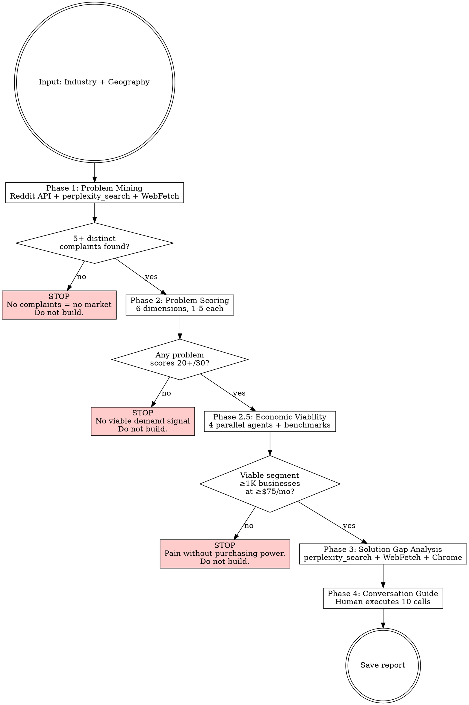

# Market Pain Research

## Overview

Find problems people are ALREADY complaining about before building anything. This replaces "pick industry -> map their systems -> build demos -> hope" with "find pain -> score urgency -> verify economics -> verify gap -> THEN build."

**Core rule:** If you can't find complaints, there's no market. A blank Phase 1 is a valid, valuable result — it means don't build here.

**This is a RIGID workflow.** Each phase gates the next. No skipping.

## Reference materials

Deeper material lives in this skill's `reference/` folder. Open these alongside the skill on your first run:

- `reference/glossary.md` — definitions for MRR, TAM, addressable segment, replacement spend, SWAP vs NEW LINE, moat, kill switch, platform risk, gap durability.
- `reference/scoring-rubric.md` — anchored scoring descriptions with worked cases for every dimension in Phase 2 and Phase 4.
- `reference/worked-examples.md` — three end-to-end walk-throughs: a clean PROCEED, a high-score KILL, and a Phase 1 kill. Read the first example before your first run.
- `reference/industry-tracker-template.md` — copyable tracker schema with examples (full + minimal versions).

## Industry Tracker (optional but recommended)

If you are researching multiple industries, keep a tracker file (e.g. `industry-tracker.md` in your working directory) with: status, scores, outcomes, rankings. Always read it first when this skill is invoked — it tells you what's been done, what's queued, and the current rankings.

See `reference/industry-tracker-template.md` for the schema and a working example.

## Input Modes

### Mode 1: Pick an industry (no argument or "pick")

`/market-pain` or `/market-pain pick`

1. Read the tracker (if one exists)
2. Show the user a top-candidates table, marking any already researched
3. Ask: "Which industry do you want to research next? Pick a number, or name one from the full list."
4. Once chosen, proceed to Phase 1

### Mode 2: Research a specific industry

`/market-pain [industry] in [geography]`

Example: `/market-pain plumbing in australia`

1. Check the tracker to see if this industry has already been researched
2. If already DONE with Phase 2.5: show the existing report summary and ask "Re-run or pick a different one?"
3. If DONE but missing Phase 2.5: say "This report has Phases 1-4 but no economic viability analysis. Running Phase 2.5 now." Skip to Phase 2.5, using the existing Phase 2 scores to identify qualifying problems.
4. If not done: proceed to Phase 1

### Mode 3: Compare completed research

`/market-pain compare`

1. Read the tracker and all completed reports
2. Build a comparison matrix across all researched industries:

| Dimension | Industry A | Industry B | Industry C |
|-|-|-|-|
| Top problem score (/30) | | | |
| Market size (businesses) | | | |
| Accessibility (OPEN/MIXED/GATED) | | | |
| Competitor density | | | |
| Gap clarity (HIGH/MED/LOW) | | | |
| Buildability on your stack | | | |
| Price ceiling (target segment) | | | |
| Current software spend | | | |
| Top problem replacement spend | | | |
| Sell type (SWAP/NEW) | | | |
| Viable segment + count | | | |
| MRR at 1% penetration | | | |
| Platform Risk | GREEN/YELLOW/RED | GREEN/YELLOW/RED | GREEN/YELLOW/RED |
| Human validation result | | | |
| Time to first revenue (estimate) | | | |

3. For reports missing Phase 2.5 data: note "ECONOMICS: NOT ASSESSED." Do NOT fill in economic dimensions with guesses — flag them as needing a Phase 2.5 run.
4. Recommend the strongest vertical with rationale
5. If < 3 industries researched, say: "Need at least 3 completed reports for a meaningful comparison. [X] done so far. Pick another industry to research."

## Post-Research Update (MANDATORY if using a tracker)

After EVERY `/market-pain` run (even kills), update the tracker:

1. Read the tracker
2. Add the industry to the "Completed Research" table with: date, status, top score, top problem, report path, recommendation
3. Remove it from "Queued for Research" if it was there
4. Update top rankings if new data changes the picture (e.g., if a top-ranked industry was killed, move it down)
5. Save the tracker

## Workflow



## Source Access Protocol (applies to ALL phases)

Every source MUST be attempted. Never skip a source because the first method failed.

1. **Try WebFetch first** — fetch the URL directly for full page content
2. **If robots.txt blocked or empty** — IMMEDIATELY use Chrome MCP tools: `mcp__Claude_in_Chrome__navigate` to the URL, then `mcp__Claude_in_Chrome__get_page_text` or `mcp__Claude_in_Chrome__read_page` to extract content. **Do NOT skip this step.** Many competitor sites, marketplaces, and industry pages block automated access but load fine in a real browser.
3. **If Chrome also fails** — document the failure in the report. Note source as "inaccessible" with reason
4. **Log which method worked** for each source in the Methodology Notes section

### Chrome Fallback is MANDATORY for These Sources

The following source types are frequently robots.txt-blocked or return incomplete data via WebFetch/WebSearch. **Always attempt Chrome MCP** if the first method returns incomplete results:

- **Competitor product pages** — marketing sites often block scrapers
- **Platform marketplace pages** — essential for complete competitor cataloguing
- **Government benchmark pages** — frequently 403-blocked
- **Industry association member pages** — often behind login walls, but public pages may still block bots
- **Review platforms** — some block automated access
- **Competitor pricing pages** — often dynamically loaded, invisible to WebFetch

**The rule**: If a URL matters for your analysis and WebFetch returns less than you'd expect, open it in Chrome. Don't document "inaccessible" without trying Chrome first.

### Reddit JSON API (preferred method for Reddit)

WebFetch blocks reddit.com. Use Python `requests` via Bash to hit Reddit's free JSON API instead. No auth needed.

**Search within subreddits:**
```python
import requests, json
headers = {'User-Agent': 'market-research/1.0'}
url = 'https://www.reddit.com/r/{subreddit}/search.json?q={query}&restrict_sr=on&sort=relevance&t=all&limit=25'
r = requests.get(url, headers=headers, timeout=10)
posts = r.json()['data']['children']
for p in posts:
    d = p['data']
    # d['title'], d['selftext'], d['score'], d['num_comments'], d['subreddit'], d['permalink']
```

**Search across ALL subreddits:**
```python
url = 'https://www.reddit.com/search.json?q={query}&sort=relevance&t=all&limit=25'
```

**Fetch thread comments (gold for verbatim quotes):**
```python
url = f"https://www.reddit.com{post['data']['permalink']}.json?limit=25&sort=top"
r = requests.get(url, headers=headers, timeout=10)
data = r.json()
# data[0] = post, data[1] = comments
comments = data[1]['data']['children']
for c in comments:
    if c['kind'] == 't1':
        # c['data']['body'], c['data']['score']
```

**Target subreddits per industry type:**
- Trades: r/plumbing, r/electricians, r/HVAC, r/Construction, r/trades
- Healthcare: r/dentistry, r/optometry, r/physicaltherapy, r/medicine
- Professional services: r/Accounting, r/LawFirm, r/RealEstate
- General business: r/smallbusiness, r/Entrepreneur, r/sweatystartup
- Geography-specific: local country / region subreddits, finance + property subs

**Geography note:** Reddit skews US/global. This is fine — operational pain points (missed calls, admin burden, software frustrations) are universal across English-speaking markets. Use global Reddit data as **calibration signal** for problem severity and frequency, not as proof of geography-specific demand. Local validation comes from other sources (local forums, industry groups, Phase 4 calls). Tag Reddit findings as "GLOBAL" in the report when they're not sourced from the target geography.

**Query construction for pain-language:**
- Use `OR` for multiple pain terms: `"missed+calls"+OR+"losing+jobs"+OR+"admin+nightmare"`
- Use `restrict_sr=on` when searching within a subreddit
- Use quotes (`%22`) for exact phrases
- Sort by `relevance` first, then `top` for highest-signal posts
- High-value signals: score 50+, comments 20+, selftext contains workarounds or $ amounts

**Rate limit:** ~60 requests/minute. Batch subreddit searches in a single Bash call with a loop.

**Encoding note:** Reddit posts contain Unicode. Always add `encoding='utf-8'` or pipe through `json.dumps(ensure_ascii=True)` when printing.

### Research Tool Hierarchy (use the RIGHT tool for each data type)

| Data Type | Tier 1 (Perplexity) | Tier 2 (Built-in only) | Tier 3 (Manual) |
|-|-|-|-|
| Forum complaints, verbatim quotes | Reddit JSON API (curl) → save → grep-verify | Reddit JSON API (curl) → save → grep-verify | User pastes thread text into `evidence/raw/manual-*.md` |
| Finding real source URLs | `perplexity_search` → save URL list | `WebSearch` → save result list | User pastes URL list |
| Extracting data from sources | `WebFetch` → save → grep-verify | `WebFetch` → save → grep-verify | User pastes page text into `raw/manual-*.md` |
| Theme discovery (directions only) | `perplexity_ask` (search_context_size: high) | `WebSearch` query like "what {industry} owners complain about" → fetch top results | User pastes 2-3 forum thread URLs |
| Robots.txt-blocked pages | Chrome MCP → save | Chrome MCP → save | User pastes manually |
| Gap analysis, synthesis | Claude synthesis from `[E:S#]` ledger entries only | Same | Same |

**Banned regardless of tier**:
- `perplexity_research` — cost + unreliability documented across many runs
- Citing from snippets (Perplexity description, WebSearch description) without WebFetch + save + grep-verify
- Specific numbers (business count, pricing, market share) tagged anything other than `[E:S#]`

**`perplexity_ask` rule**: theme discovery ONLY. Output goes into a working-notes scratch, never into the ledger or report. Anything you'd cite must be re-grounded via `perplexity_search` → WebFetch → save → grep-verify.

### Verified Research Protocol (Evidence Ledger discipline)

Every factual claim in the report follows the **Evidence Ledger Protocol** at `reference/evidence-ledger-protocol.md` (this skill's own copy — self-contained). Read it once before Phase 1.

**The three rules:**
1. **Raw-first** — every fetched page saves to `evidence/raw/{type}-{slug}-{date}.{ext}` BEFORE anything is written into the ledger.
2. **Grep-verify every quote** — after writing a verbatim quote in `evidence/evidence.md`, run `Grep` on the raw file for an 8-12 word substring. Zero matches = hallucinated, delete.
3. **Cite by Source #** — every claim in the report is tagged `[E:S#]` (evidence) or `[I:S#,S#]` (inference) or `[A]` (assumption, excluded from kill switches). No bare URLs in the report body.

**Three-tier hierarchy** (skill auto-detects which tier the user is on):

| Tier | When | Tools | Notes |
|-|-|-|-|
| **1** | Perplexity MCP installed | `perplexity_search` → `WebFetch` → save → grep-verify | `perplexity_ask` allowed for theme discovery only; never cite from it |
| **2** | No Perplexity (default for public toolkit users) | `WebSearch` → `WebFetch` → save → grep-verify; Reddit via curl + JSON API | Same discipline, more steps |
| **3** | No internet / no MCP | User pastes URLs + page content into `evidence/raw/manual-*.md` | Same grep-verify discipline; pasted file IS the raw |

**Hard rules (apply to all tiers):**
- NEVER cite a specific number (business count, revenue, margin %, pricing) without a fetched-and-grep-verified source
- NEVER cite from a snippet (Perplexity description, WebSearch description) — must WebFetch + save + grep-verify
- If WebFetch fails on a URL, try Chrome MCP before marking `[INACCESSIBLE]`
- Subagent quote claims are NOT trusted — main context re-runs `Grep` on each before merging into master ledger
- Forbidden phrases (signal hallucination): "Many users say…", "It's commonly reported…", "Industry studies show…", "Research suggests…", "Most {industry} businesses…". Replace with structured citations per the protocol.

**Kill switches count ledger entries, not vibes.** Phase 1 "≥5 complaints" = ≥5 `[E:S#]` ledger entries with complaint quotes. Phase 2.5 "≥1,000 businesses at ≥$75/mo" = `[E:S#]` source for the count + `[E:S#]` source for the price. `[A]` (assumption) entries do NOT count toward kill switches.

---

## Phase 0: Evidence Setup (ALWAYS run first)

Before any research starts, initialize the evidence ledger so every claim made downstream is grep-verifiable.

```bash
mkdir -p evidence/raw
test -f evidence/evidence.md || cat > evidence/evidence.md <<'EOF'
# Evidence Ledger — [industry] in [geography], $(date +%Y-%m-%d)

**Tier**: [1=Perplexity / 2=Built-in / 3=Manual]

## Index

| # | Source type | URL | Fetched | Raw file | Status |
|-|-|-|-|-|-|

EOF
```

Announce: "Phase 0: Evidence ledger initialized at `evidence/evidence.md`. Tier: [1/2/3]."

**Read this skill's protocol reference before proceeding**: `reference/evidence-ledger-protocol.md` (ships in this skill's `reference/` folder — self-contained, no cross-skill dependency). Every research call in Phases 1–8 must follow it. The three rules in one sentence: **save raw → grep-verify quotes → cite by `[E:S#]` Source #**. The protocol defines ledger entry format, the grep-verify step, forbidden phrases, and the snippet-vs-page rule.

---

## Phase 1: Problem Mining

**Goal:** Find what [industry] business owners are COMPLAINING about. Not what software they use. Not what competitors exist. Complaints, frustrations, workarounds, and the exact language they use.

**Announce:** "PHASE 1: Problem Mining for [industry] in [geography]"

### Search Terms (problem-language, NOT solution-language)

Use variations of:
- "[industry] frustrating", "[industry] admin nightmare", "[industry] biggest headache"
- "[industry] software hate", "[industry] waste of time", "[industry] losing money"
- "[industry] business owner complaints", "[industry] what I wish existed"
- "[industry] switching from", "[industry] terrible customer service"

### Sources (ALL required)

Launch parallel research using the Research Tool Hierarchy above. Use Chrome fallback per Source Access Protocol.

| # | Source | What to find | Search approach |
|-|-|-|-|
| 1 | Reddit | Industry subreddits + r/smallbusiness + country/region subs | **Use Reddit JSON API** (see protocol above). Search 3-5 industry subreddits + general business subs with pain-language queries. For high-scoring posts (50+ pts or 20+ comments), fetch thread comments for verbatim quotes. WebSearch as fallback for discovery of relevant subreddits |
| 2 | Facebook Groups | Industry-specific groups | Chrome required — groups are often private. Search for group names first, then browse recent posts |
| 3 | Country-specific forums | Business + industry forums (e.g. Whirlpool in AU, UK Business Forums) | WebSearch `site:[forum] [industry]` or Chrome navigate |
| 4 | Google Reviews | 1-3 star reviews of existing industry software | Search "[software name] reviews" filtered to negative. Look for patterns across multiple products |
| 5 | G2 / Capterra | "What do you dislike?" sections for industry tools | WebSearch or Chrome. Focus on dislike/cons sections specifically |
| 6 | Amazon | Reviews of business books in the category | Search "[industry] business books" — reviews reveal real problems. 1-3 star reviews are gold |
| 7 | Google Trends | Problem-language vs solution-language search volume | Compare "[problem term]" vs "[solution term]" in the target geography |
| 8 | Industry forums | Professional associations, trade publications, industry bodies | Search for "[industry] association [country] forum" or "[industry] magazine letters" |
| 9 | LinkedIn | Posts from business owners venting about operations, asking for help, or discussing pain points | WebSearch `site:linkedin.com [industry] [pain keyword]`. Fetch `/posts/` URLs with WebFetch. `/pulse/` articles hit login walls — use search snippets only. Search terms: "[industry] frustrating", "[industry] business owner challenge", "[industry] missed calls", "[industry] admin". Also check for engagement signals (comments, reshares) — high-engagement complaint posts indicate widespread pain |

### Research Prompts

**Prompt A — `perplexity_ask` (search_context_size: "high")** for THEME DISCOVERY ONLY:

> "What are [industry] business owners in [geography] complaining about? I want COMPLAINTS, FRUSTRATIONS, and WORKAROUNDS — not product features. Focus on: admin burden, missed revenue, staff friction, compliance headaches, customer communication failures, scheduling nightmares, technology frustrations, client dropout rates, retention problems, and burnout."

**Use Prompt A output as DIRECTIONS TO INVESTIGATE, not facts to cite.** Take the themes it returns and validate each one via Prompts B-D below. Do NOT copy any specific stats, business counts, or revenue figures from Prompt A into the report.

**Prompt B — Reddit JSON API** (see protocol above) for verbatim forum quotes. Run in parallel with Prompt A.

**Prompt C — `perplexity_search`** for software review complaints (follow Verified Research Protocol):

> Search: `"[industry] software" complaints OR "what I dislike" OR cons site:g2.com OR site:capterra.com`
> Search: `"[top tool name]" review complaints OR frustrating OR terrible`
> → WebFetch top 2-3 review URLs → extract verbatim "What do you dislike?" quotes with source URLs

**Prompt D — `perplexity_search`** for industry data to verify Prompt A themes:

> Search: `"[industry]" "[geography]" business count OR market size OR industry report`
> Search: `"[industry]" complaints OR challenges OR frustrations site:[local forums or linkedin.com]`
> → WebFetch top 2-3 URLs → extract real numbers and quotes, tag each `[E:S#]`

### Phase 1 Output

For each complaint found, document:

```
**Problem:** [Description in their exact words]
**Source:** [Platform + URL/link]
**Frequency:** [How many similar complaints found across sources]
**Existing solutions mentioned:** [What they've tried that failed]
**Emotional intensity:** [Venting / Frustrated / Desperate / Actively switching]
```

**Per-source ledger entry** (mandatory — see `reference/evidence-ledger-protocol.md` for full format):

For each complaint, append a `## S{N}` block to `evidence/evidence.md` with URL, fetched date, raw file path, source type, author, score, created date, the verbatim quote, and the grep-verify pattern + count. Then update the Index table at top.

**Phase 1 exit check**: count ledger entries tagged with complaint quotes. If <5, kill per Kill Switch #1 below. The count is **ledger entries**, not your judgment of "enough complaints found."

### Kill Switch #1

If Phase 1 finds fewer than **5 distinct complaints** across all sources:

> **STOP.** Insufficient complaint volume found for [industry] in [geography]. Either this industry doesn't have acute operational pain points, they discuss problems in channels you can't access, or they've accepted the status quo. **Do not build for this market without manual validation (10 phone calls minimum).**

Write the report with Phase 1 findings only and save it. The "no complaints found" result is valuable — it prevents wasted build time.

---

## Phase 2: Problem Scoring

**Announce:** "PHASE 2: Scoring [X] problems found in Phase 1"

Score each distinct problem on 6 dimensions (1-5 scale):

| Dimension | 1 (Low) | 3 (Medium) | 5 (High) |
|-|-|-|-|
| **Frequency** | 1-2 mentions across all sources | 5-10 mentions, multiple sources | 15+ mentions, every source |
| **Urgency** | Venting, no action taken | Asking for recommendations | Actively searching, switching, or building workarounds |
| **Spending** | Free workarounds only | Paying <$100/mo for partial fix | Paying $100+/mo, still unhappy |
| **Switching Cost** | No lock-in, easy to change | Some data migration needed | Deep integration, contracts, high switching effort |
| **Market Size** | <1,000 businesses affected | 5,000-20,000 businesses | 50,000+ businesses |
| **Buildability** | Requires hardware, regulation, or deep domain expertise | Moderate complexity, some integrations needed | Standard AI/automation solve — chatbot, workflow, integration |

### Scoring Rules

- Score based on EVIDENCE from Phase 1, not assumptions
- If a dimension has no evidence, score it 1 (assume worst case)
- Switching Cost is INVERTED for opportunity: high switching cost = harder to sell INTO, score 1-2. Low switching cost = easier to acquire, score 4-5
- Buildability must account for what you can actually deliver with your current tech stack (e.g. chatbots, workflow automation, integrations, voice AI)
- **When torn between two adjacent scores, pick the LOWER one.** Anti-inflation rule.
- **Frequency cap on single-source evidence**: If a problem's evidence comes from fewer than 3 distinct sources (e.g., one Reddit thread + one review page only), Frequency maxes out at 2 regardless of raw mention count. One thread with 20 complaints ≠ a widespread problem. Three sources with 5 complaints each ≥ one source with 20.

**For anchored descriptions + worked cases per dimension, see `reference/scoring-rubric.md`.** Use it when scoring a real vertical — the anchors remove drift between runs.

### Phase 2 Output

Ranked table:

| Rank | Problem | Freq | Urgency | Spending | Switch | Market | Build | **Total** |
|-|-|-|-|-|-|-|-|-|
| 1 | [Problem] | X | X | X | X | X | X | **XX/30** |
| 2 | [Problem] | X | X | X | X | X | X | **XX/30** |

### Kill Switch #2

If **no problem scores 20 or above** out of 30:

> **STOP.** No problem has sufficient combined demand signal. Highest score: [X]/30 for "[problem]". **Do not build for this industry.** The problems exist but aren't urgent enough, the market is too small, or existing solutions are good enough. Consider adjacent industries or a different geography.

**Scores lock once the Phase 2 table is complete. No re-scoring or rounding.** A problem at 19/30 is STOP-level. If you find yourself re-scoring a 19 as 20 to proceed, that's the rationalization the anti-inflation rule exists to prevent.

Write the report through Phase 2 and save it.

---

## Phase 2.5: Economic Viability

**Runs automatically after Phase 2 passes.** No skipping — pain without purchasing power is a trap.

**Goal:** Determine whether enough businesses can pay enough money for a viable service. Answers: "Can they afford it?" not "Do they want it?" (Phase 2 already answered that.)

### Rationalizations for skipping Phase 2.5 — all invalid

| Rationalization | Reality |
|-|-|
| "Phase 2 top score is 28+/30, economics obviously work" | High Phase 2 score measures PAIN INTENSITY, not purchasing power. Accounting example in `reference/worked-examples.md` scored 27/30 and was killed at Phase 3 for economic reasons Phase 2.5 should have caught. Run Phase 2.5. |
| "I know this industry, they can afford it" | "I know this industry" fails the Verified Research Protocol. Run Phase 2.5. |
| "Just run a quick version" | The 4 streams take ~20 min in parallel. "Quick version" = skip. Run Phase 2.5 properly or don't run the skill. |
| "Phase 2.5 always passes for viable verticals" | Survivorship bias. The kills you remember are Phase 1 and Phase 3. Phase 2.5 has killed real verticals in real runs (segment too small, price ceiling below floor). Run it. |

If you're about to skip Phase 2.5, stop. Run it. If it passes, you lost 20 minutes. If it kills, you saved a month.

**Announce:** "PHASE 2.5: Economic Viability Analysis for [industry] in [geography]"

**Phase 0 precondition check**: if `evidence/evidence.md` does not exist, run Phase 0 first. The subagent prompts below assume `evidence/raw/` is on disk; without it, raw saves silently fail.

### Research Architecture

Launch 4 parallel research streams. Each follows the Verified Research Protocol: `perplexity_search` → `WebFetch` top URLs → save raw → grep-verify → ledger entry `[E:S#]`.

**Each stream's subagent prompt MUST include**:
- "Save raw fetched content to `evidence/raw/{stream-name}-{source-slug}-{date}.md` BEFORE returning."
- "Return ledger entries in the format from `reference/evidence-ledger-protocol.md`. Include the `Grep-verified` field with the pattern + count you actually ran."
- "If you cannot grep-verify a quote, drop it — do not paraphrase."
- "Forbidden phrases (signal hallucination): 'Many users say', 'Industry studies show', 'Research suggests', 'Most {industry} businesses'. Do NOT cite snippets — WebFetch every URL you plan to cite."

**After streams return**: main context re-runs `Grep` on each subagent-claimed quote against the saved raw file. Merge only verified entries into master `evidence/evidence.md`. Subagent trust is verify-then-merge, not trust-and-merge.

**Stream 1: Business Economics (Benchmarks + Industry Data)**

Run these `perplexity_search` queries:
> `"[industry]" [geography] "business count" OR "number of businesses" statistics industry`
> `"[industry]" small business benchmarks margin profit`
> `"[industry]" [geography] profit margin OR revenue OR "industry report"`

Then WebFetch the top 2-3 URLs from each search. Extract: (1) business count by size tier, (2) benchmark margins (cost of sales %, total expenses %), (3) revenue ranges by business size, (4) growth/decline trend. Tag every number `[E:S#]` or `[A]`.

**Stream 2: Current Technology Spend**

Run these `perplexity_search` queries:
> `"[industry]" software pricing [geography] OR "per month" OR "/mo"`
> `"[industry]" "[top tool name]" pricing tiers`
> `"[industry]" technology adoption OR "still using spreadsheets" OR "paper based"`

Then WebFetch each tool's ACTUAL PRICING PAGE (not review summaries). Extract: (1) exact pricing tiers per tool, (2) target business size, (3) any survey data on tech adoption rates. Tag every price `[E:S#]`.

**Stream 3: Problem-Specific Replacement Spend**

Run these `perplexity_search` queries (one per qualifying problem):
> `"[industry]" "[problem keyword]" cost OR spend OR pricing OR "answering service" [geography]`
> `virtual receptionist OR answering service [geography] pricing "[industry]"`
> `"[industry]" "[problem]" outsource OR contractor OR "virtual assistant" cost`

Then WebFetch the top results. Extract per-problem: (1) current spend on workarounds, (2) answering service / VA pricing, (3) software that partially solves it + its price. The critical question: SWAP sell (existing budget) or NEW LINE ITEM ($0 current spend)?

**Stream 4: Price Sensitivity Signals**

Run these `perplexity_search` queries:
> `"[industry]" software "too expensive" OR "not worth it" OR "switched from" site:reddit.com OR site:g2.com`
> `"[top tool]" pricing complaints OR "price increase" OR "cheaper alternative"`

Then WebFetch top Reddit threads and review pages. Extract VERBATIM quotes about pricing with source URLs. Look for: psychological spending ceiling, what triggers resistance, ROI framing ("saves me X hours" vs "just another cost").

### Government / Industry Benchmark Protocol

Most countries publish small-business benchmark data through a tax authority or statistics bureau (e.g. ATO in Australia, IRS/Census in the US, HMRC/ONS in the UK). Find the equivalent for your target geography:

**Steps:**
1. Identify the industry classification code for the target geography (e.g. ANZSIC in AU, NAICS in US/CA, SIC in UK)
2. Navigate to the benchmark publication via Chrome (`mcp__Claude_in_Chrome__navigate`) or WebSearch
3. Extract for BOTH turnover ranges (small and medium):
   - Cost of sales (% of turnover)
   - Total expenses (% of turnover)
   - Implied net margin = 100% - total expenses %
4. Calculate profit in actual dollars at representative turnover levels:
   - Solo operator ($150K): margin % × $150K
   - Small business ($500K): margin % × $500K
   - Medium business ($1M): margin % × $1M

**Government pages are often 403-blocked** by scrapers and WebFetch. Expect fallback to be the primary path. Try Chrome first, but don't spend more than 2 attempts.

**Fallback sources:** Industry body reports, publicly indexed summaries, bank benchmarking reports, insurance company surveys, accounting firm benchmark publications. Document which source was used and note "[primary] blocked — used [source]" in methodology.

### Analysis (after all 4 agents return)

**Step 1: Market Segmentation by Ability to Pay**

| Segment | Employees | Est. count | Revenue range | Net margin | Annual profit | Current software spend | Realistic price ceiling |
|-|-|-|-|-|-|-|-|
| Micro/solo | 0-1 | X | $X-Y | X% | $X | $X/mo | $X/mo |
| Small | 2-5 | X | $X-Y | X% | $X | $X/mo | $X/mo |
| Medium | 6-20 | X | $X-Y | X% | $X | $X/mo | $X/mo |
| Large | 20+ | X | $X-Y | X% | $X | $X/mo | $X/mo |

**Price ceiling rule of thumb:** The realistic ceiling is the HIGHER of:
- Current total software spend × 20% (room for one more tool)
- Current replacement spend on the specific top problem (direct swap budget)

**Critical distinction:**
- **SWAP sell** (replacement spend > $0): "Replace your $X/mo answering service with a $Y/mo AI." Easy.
- **NEW LINE ITEM** (replacement spend = $0): "Add $X/mo you're not currently spending." Hard. Must justify with clear ROI.

**Step 2: Revenue Model at Three Price Points**

| Scenario | Price/mo | Target segment | Addressable businesses | MRR at 1% | MRR at 5% |
|-|-|-|-|-|-|
| Entry | $X | [Segment] | X | $X | $X |
| Mid | $X | [Segment] | X | $X | $X |
| Premium | $X | [Segment] | X | $X | $X |

**Step 3: Problem-Spend Matrix**

| Problem (20+/30) | Score | Current spend | Spend type | Sales difficulty |
|-|-|-|-|-|
| [Problem 1] | XX/30 | $X/mo | SWAP / NEW | Easy / Medium / Hard |
| [Problem 2] | XX/30 | $X/mo | SWAP / NEW | Easy / Medium / Hard |

### Kill Switch #3 (Economics)

| Condition | Decision |
|-|-|
| No segment with ≥1,000 businesses can afford ≥$75/mo | **KILL** — unit economics don't work for a services business |
| Addressable segment (has pain AND can pay) < 1,000 businesses total | **KILL** — market too small for sustainable revenue |
| ALL qualifying problems have $0 replacement spend AND price ceiling < $100/mo | **KILL** — new budget line at low price is unsellable |
| Only viable segment is 20+ employees | **YELLOW FLAG** — enterprise sales cycle, different go-to-market required |
| Industry revenue declining > 5%/yr | **YELLOW FLAG** — businesses cutting costs, not adding tools |
| > 40% of market on pen-and-paper / no software | **YELLOW FLAG** — half the TAM hasn't crossed the "pay for software" threshold |

**$75/mo floor rationale:** A services business has per-customer delivery costs (hosting, API usage, support time). Below $75/mo, margins are too thin. A single self-serve product (e.g., AI receptionist) can work at $79/mo; bundles with any support need $150+/mo. Adjust this floor if the delivery model differs.

**Yellow flags don't kill** — they add context for the final decision. Two yellow flags together may effectively be a kill.

---

## Phase 3: Solution Gap Analysis

**Only run for problems that BOTH:**
- Scored 20+/30 in Phase 2, AND
- Passed the Phase 2.5 economic viability check (viable segment ≥1K businesses at ≥$75/mo for their own top-problem variant)

A problem can score 25/30 in Phase 2 and still fail Phase 2.5 if the addressable segment is too small or the price ceiling is too low. Don't bring killed problems into Phase 3.

**Announce:** "PHASE 3: Analysing solution gaps for [X] qualifying problems"

### Mandatory Marketplace Audit (BEFORE competitor research)

**This step is non-negotiable.** Before researching individual competitors, identify the dominant industry platform's app marketplace (e.g. practice-management system app stores, service-trade platform marketplaces, property-management system app stores) and **visit the actual page** via Chrome or WebFetch. Catalogue EVERY AI/automation tool listed — name, one-line description, category. This is the true competitive landscape, not what comes up in Google searches.

**Why**: Search results find the top 3-5 competitors. Marketplace pages reveal the full field. A search might show 10 apps — the actual marketplace might have 26+. Undercounting competitors leads to overconfident "gap" claims.

**Enforcement — MANDATORY field in Phase 3 output:**

Every Phase 3 output MUST include this field at the top, filled in before any gap claims:

```
**Marketplace audit completed:** YES / NO
- Platform(s) audited: [list specific marketplace URLs visited]
- Tools catalogued: [count, e.g., "26 tools listed"]
- Audit method: [Chrome / WebFetch / both]
- Ledger source: [E:S#] (raw file in evidence/raw/ contains the tool list — first 3 tool names: [name1, name2, name3])
```

**If this field says NO or is empty, the Phase 3 report is INVALID.** Stop, audit the marketplace, then re-run Phase 3. No gap claims without the audit. No exceptions.

**Audit attestation must be ledger-backed**: the cited tool count and the first 3 tool names must trace to an `[E:S#]` ledger entry whose raw file (`evidence/raw/marketplace-{platform}-{date}.md` or screenshot) contains the actual list. An audit attestation without a corresponding raw file is a hallucination and the report is invalid.

### Mandatory Competitor Page Visits (BEFORE claiming gaps)

For every competitor identified (marketplace + search), **visit their actual product page** (website + marketplace listing). Do NOT rely on search result snippets or agent summaries alone. Read the exact feature description. Check:
1. What features do they currently offer?
2. What adjacent features could they add in ONE SPRINT using their existing infrastructure?
3. Are they already doing something close to your proposed "gap"?

For each competitor, visit these THREE pages (WebFetch first, **Chrome MCP immediately if blocked**):
1. **Main website** — features, positioning, team
2. **Marketplace listing** — exact feature description as shown to buyers
3. **Pricing page** if separate

**Subagents CANNOT use Chrome MCP.** If you delegate competitor research to subagents and they report a page as "inaccessible" or return only search-result summaries, YOU must follow up by opening the actual URLs in Chrome yourself. Do not accept "NOT FOUND" from a subagent without trying Chrome in the main context.

**Why**: A search for a competitor name returns marketing copy. Their marketplace page reveals exact features. A one-URL visit can reveal a moat-killing overlap that research agents missed because they searched FOR competitors instead of visiting THEIR pages.

### Gap Durability Test (AFTER identifying gaps)

For every "gap" identified, answer these three questions BEFORE calling it an opportunity:

1. **Sprint test**: Could the nearest existing competitor close this gap in a single development sprint (2-4 weeks)? If yes, it's a **feature gap**, not a moat. Label it: "FEATURE GAP — low durability."
2. **Infrastructure test**: Does closing the gap require fundamentally different infrastructure (new data source, new platform, regulatory certification)? If yes, it may be a **structural gap** with higher durability. Label it: "STRUCTURAL GAP — medium/high durability."
3. **Data test**: Does the gap require proprietary data that competitors cannot easily acquire? If yes, it's a **data moat**. Label it: "DATA MOAT — high durability."

**Gap Durability Rating** (include in Phase 3 output for every gap):
- **FEATURE GAP**: Any adjacent competitor could add this in 1-2 sprints. NOT a moat. May still be a first-mover opportunity if you ship fast, but expect competition within 6 months.
- **STRUCTURAL GAP**: Requires different architecture, data source, or regulatory work. Moderate moat. 6-12 months before competitors could match.
- **DATA MOAT**: Requires proprietary data that improves with usage. Strong moat. Competitors cannot replicate without similar customer base.

**If all identified gaps are FEATURE GAPs, explicitly flag this in the report**: "WARNING: All gaps are feature-level only. No structural or data moat identified. Competitive advantage depends on speed-to-market, not defensibility."

### Research Prompt

For each qualifying problem, follow the Verified Research Protocol:

**Step 1 — Find competitors** via `perplexity_search`:
> `"[industry]" "[problem keyword]" software OR app OR tool OR platform [geography]`
> `"[industry]" AI OR automation "[problem keyword]"`

**Step 2 — Fetch each competitor's actual pages** via `WebFetch` (Chrome fallback if blocked):
- Main website (features, positioning)
- Pricing page (exact tiers)
- Review pages on G2/Capterra (negative reviews, "What do you dislike?")

**Step 3 — Extract and tag**: competitor name, exact pricing `[E:S#]`, key weaknesses from real reviews `[E:S#]`, features users request. Do NOT trust search snippets for pricing — fetch the real page.

Apply Source Access Protocol — use Chrome fallback for any blocked sources.

### Platform Integration Risk

**IMPORTANT: Do not assume API access is achievable just because integrators exist. Verify: (a) is access read-only or read-write by default? (b) is there a public developer portal or is it partnership-based? (c) have small/new companies (<5 employees, <1 year old) successfully gotten access?**

Identify the top 3-5 software platforms used by the industry. For each platform, document:

| Platform | Est. Market Share | API Access | Default Access Level | Developer Portal | Partner App Required |
|-|-|-|-|-|-|
| [Name] | X% | OPEN / GATED / NONE | READ-ONLY / READ-WRITE / UNKNOWN | YES (URL) / NO | YES / NO |

**Scoring adjustment:** If platforms with GATED or READ-ONLY APIs cover >50% of the market, deduct 3-5 points from the Buildability dimension of each top pain score (because the solution can't fully automate without write access). Apply 3-point deduction if gated-but-achievable, 5-point deduction if gated + read-only default. Note the adjusted scores separately as "Integration-Adjusted Score" alongside the original score.

**Platform Risk rating:**
- **GREEN**: Dominant platforms have open, read-write APIs with public developer portals
- **YELLOW**: Dominant platforms are gated but achievable (partner path exists, small companies have gotten access)
- **RED**: Dominant platforms are gated + read-only by default, covering >50% of market

Flag the Platform Risk rating prominently in the Phase 3 output.

### Phase 3 Output

**Top of Phase 3 report — MANDATORY audit confirmation** (without this the report is invalid):

```
## Phase 3 Preconditions

**Marketplace audit completed:** YES
- Platform(s) audited: [list specific URLs visited]
- Tools catalogued: [count]
- Audit method: [Chrome / WebFetch / both]

**Competitor page visits completed:** YES
- Competitors visited: [count]
- Pages visited per competitor: [typically 3 — website, marketplace listing, pricing]
```

For each qualifying problem:

```
**Problem:** [From Phase 2]
**Score:** [X/30]

### Existing Solutions

| Solution | Price | Years in Market | Key Weakness | User Complaints (verbatim) | Ledger |
|-|-|-|-|-|-|
| [Name] | [Price] `[E:S#]` | [Years] | [Failure point] `[E:S#]` | "[exact quote]" `[E:S#]` | S# |

**Every row must cite `[E:S#]` for price + verbatim complaint quote.** The Ledger column lists the source numbers from `evidence/evidence.md`. A solution row without ledger backing for price and complaint = unsupported claim, drop it.

### The Gap
[What users want that nobody provides — be specific. Cite `[E:S#]` or `[I:S#,S#]` for every user-want claim. Bare assertions like "users want X" without a ledger source = `[A]` and excluded from gap durability scoring.]

### Gap Durability
- **Rating**: FEATURE GAP / STRUCTURAL GAP / DATA MOAT
- **Sprint test**: Could [nearest competitor] add this in one sprint? [YES/NO — explain]
- **Infrastructure test**: Does this require fundamentally different infra? [YES/NO — explain]
- **Data test**: Does this require proprietary data? [YES/NO — explain]

### Your Opportunity
[How AI/automation could fill this gap — reference specific capabilities]

### Confidence Level
- **HIGH**: 10+ complaints about the gap, clear buildable solution, no dominant competitor, STRUCTURAL or DATA moat
- **MEDIUM**: 5-10 complaints, solution is buildable but complex, some competition, or FEATURE GAP only
- **LOW**: <5 complaints about specific gap, solution requires capabilities you don't have, or all competitors could trivially add this
```

### Whitespace Analysis: What's NOT on the Marketplace?

**Runs AFTER the gap analysis for scored problems.** This section flips the lens: instead of asking "who else solves this problem?", ask "what automation opportunities exist that NOBODY in this marketplace is addressing at all?"

**Why this matters**: The marketplace audit catalogues what competitors DO. But marketplace apps cluster around obvious use cases (phone answering, reminders, notes). The real opportunities may be in categories nobody has entered — things that aren't on the marketplace because no competitor thought to build them.

**Process**:

1. **Map the industry workflow end-to-end**: Pre-visit → Visit → Post-visit → Business ops. List every step where a human does repetitive work.

2. **Cross-reference against marketplace**: For each workflow step, check: is there an app on the marketplace for this? If not, it's whitespace.

3. **Apply 10 AI service categories**: For each category below, ask: does ANY marketplace app serve this for this industry?

| # | Category | Marketplace served? | Whitespace opportunity |
|-|-|-|-|
| 1 | Campaign Management | YES/NO | [If NO: what could be built?] |
| 2 | Ad Copy & Creative | YES/NO | |
| 3 | Email Sequences | YES/NO | |
| 4 | Lead Scoring / Qualification | YES/NO | |
| 5 | Funnel Optimisation | YES/NO | |
| 6 | UX & Usability | YES/NO | |
| 7 | Content & SEO | YES/NO | |
| 8 | CRM & Retention | YES/NO | |
| 9 | Personalisation | YES/NO | |
| 10 | Reporting & Analytics | YES/NO | |

4. **For each whitespace opportunity, answer BOTH questions**:

**A. Services play** (bespoke, high-touch): Could you deliver this as a custom engagement for individual practices? What would it look like? Estimated price? Does it require deep domain expertise?

**B. Product play** (scalable SaaS): Could this be a repeatable product listed on the marketplace? What's the TAM? Could competitors trivially add it? Would it have a moat?

5. **Output: Whitespace Opportunity Table**

| Opportunity | Category | Services play? | Product play? | Moat type | Why nobody built it yet |
|-|-|-|-|-|-|
| [Description] | [1-10] | [YES/NO + price] | [YES/NO + TAM] | [FEATURE/STRUCTURAL/DATA/NONE] | [Explanation] |

**The "Why nobody built it yet" column is critical.** If the answer is "because it's not valuable enough" — skip it. If the answer is "because it requires cross-system data that marketplace apps can't access" — that's a structural opportunity. If the answer is "because nobody thought of it" — it's a feature gap that will be copied quickly.

---

## Phase 4: Conversation Guide

**Announce:** "PHASE 4: Generating conversation guide for human validation"

This phase generates the script. **The human executes the calls.** AI cannot do this part.

**Evidence Ledger applies differently to Phase 4.** Phases 1–3 ledger entries trace to fetched-and-grep-verified raw files. Phase 4 calls have no equivalent mechanical proof (no recording-MCP exists in this skill). Therefore:
- Every Phase 4 quote cited in the final report is tagged `[A]` (assumption) — Phase 4 evidence cannot feed kill switches that require `[E:S#]`.
- The post-call scoring rubric is the human-agent's attestation. Treat it as input to a judgment call, not a mechanical pass/fail.
- Phase 4 calls may be logged with date + contact name (or "confidential") + one-line problem statement in `evidence/raw/phase4-calls-{date}.md` for traceability, but this is logging, not verification.

### MANDATORY: Phase 4 is non-negotiable before any BUILD decision

Phases 1–3 find what people *say* they want online. Phase 4 verifies what they *actually* pay for and use. **Do not build without Phase 4.**

### Rationalizations for skipping Phase 4 — all invalid

| Rationalization | Reality |
|-|-|
| "Phase 3 gap is obvious, I don't need calls" | Online complaints reveal frustrations, not purchasing behavior. People complain about things they won't pay to fix. |
| "I'm confident in my segment" | Confidence is survivorship bias from your wins. The losses you don't remember look like "pain was clear online but nobody bought" — that's a Phase 4 kill you didn't run. |
| "I'll start building and validate as I go" | Build-first = 3 months sunk before hearing "I wouldn't pay for that." Calls = 10 hours to hear the same signal. |
| "The numbers in Phase 2.5 prove it" | Phase 2.5 proves economic theory (they CAN pay). Phase 4 proves behavior (they WILL pay). Different things. |
| "I already know people in this industry" | If so, great — they're your first 3 calls. Do 7 more with strangers who have no social pressure to agree with you. |

**Kill Switch #4**: If you complete Phases 1–3 and skip Phase 4, you have NOT validated demand. You have a research report, not a build signal. Do not announce "demand validated" or commit to building until Phase 4 completes.

The only exception: you've already built the thing and have paying customers in this exact segment. If that were true, you wouldn't be running `/market-pain`.

### Discovery Call Script

Generate a tailored script using the EXACT language from Phase 1 complaints. Not generic questions — specific to what was found.

**Opening (30 seconds):**
> "Hi, I'm [name]. I'm researching how [industry] businesses handle [broad problem category from Phase 2]. I'm not selling anything — just trying to understand what's actually frustrating for business owners. Mind if I ask a few quick questions?"

**Problem Validation (5 questions):**
1. "How do you currently handle [problem in their exact words from Phase 1]?"
2. "What have you tried to fix that?"
3. "Roughly how much time or money does [problem] cost you per week/month?"
4. "If you could wave a magic wand and fix one operational headache, what would it be?"
5. "Have you looked at [competitor from Phase 3]? What did you think?"

**Willingness to Pay (3 questions):**
6. "If something completely solved [top problem], what would that be worth to you monthly?"
7. "Are you currently paying for anything that tries to address this?"
8. "What would need to be true for you to switch from what you have now?"

**Discovery Close (2 questions):**
9. "Is there a problem I didn't ask about that's actually worse than what we discussed?"
10. "Do you know other [industry] business owners who'd be open to a quick chat about this?"

### Post-Call Scoring Rubric

After each call, score:

| Signal | Score |
|-|-|
| **Problem confirmed?** | YES (described pain unprompted) / PARTIAL (agreed when prompted) / NO |
| **Currently spending?** | YES ($X/mo on bad solution) / NO (using workarounds) |
| **Willingness to pay?** | $X/mo stated / "Not sure" / "No" |
| **Urgency?** | 1-5 (1 = "someday", 5 = "I need this yesterday") |
| **Referral offered?** | YES (gave names) / NO |

### Go/No-Go After 10 Calls

| Result | Decision |
|-|-|
| **7+ confirmed the problem** | BUILD IT. You have validated demand. |
| **5-6 confirmed** | REFINE the offer description and do 5 more calls |
| **<5 confirmed** | DO NOT BUILD. Online complaints overstated the real-world pain. Reassess the industry. |

---

## Phase 5: Systems & Connectivity (Deep Dive)

**Only run if Phase 4 is reached AND the user requests a deep dive.** This phase answers: "Can you actually build and integrate?"

**Announce:** "PHASE 5: Systems & API Connectivity Analysis for [industry] in [geography]"

**Gate:** Present findings to user. Ask "Does this change direction? Confirm before Phase 6."

### Research Architecture

Launch 4 parallel research streams following the Verified Research Protocol:

**Stream 1: Industry Software Market Share**
> `perplexity_search`: `"[industry]" software market share [geography] OR "[dominant platform]" users`
> `perplexity_search`: `"[industry]" "still using spreadsheets" OR "no software" OR "pen and paper" [geography]`
> → WebFetch top results. Extract platform names, user counts, pricing. Tag `[E:S#]`.

**Stream 2: Primary Platform API Deep Dive**
> `perplexity_search`: `"[dominant platform]" API documentation OR developer portal OR integration`
> → WebFetch the actual developer docs / API reference page. Extract: access level (open/gated), endpoints, auth method, webhooks, rate limits. Tag `[E:S#]`.

**Stream 3: Secondary Platform APIs**
> Same pattern for #2 and #3 platforms + any legacy systems.

**Stream 4: Build Stack Feasibility**
> `perplexity_search`: `"[key technology]" pricing [geography] OR "per minute" OR "per message"`
> → WebFetch each vendor's actual pricing page. Extract per-customer cost model. Tag `[E:S#]`.

### Gating Assessment

Rate API accessibility as: **OPEN** (self-serve) / **GATED-GREEN** (partner path exists, others have done it) / **GATED-YELLOW** (partner path exists, heavy obligations) / **GATED-RED** (no clear path) / **NONE** (no API).

**Key question:** Can the MVP launch WITHOUT platform integration? If yes, the gate is not blocking. Document standalone viability separately from integrated viability.

---

## Phase 6: Legal & Compliance (Deep Dive)

**Announce:** "PHASE 6: Legal & Compliance Analysis for [industry] in [geography]"

**Gate:** Present findings to user. Ask "Any concerns before Phase 7?"

### Research Architecture

Launch 3 parallel research streams following the Verified Research Protocol:

**Stream 1: Privacy & Data Law**
> `perplexity_search`: `privacy law [geography] "small business exemption" AI OR automation`
> `perplexity_search`: `"[industry]" data privacy regulation [geography] OR "call recording" consent`
> → WebFetch the actual legislation pages or regulator guidance. Extract applicability, exemptions, requirements. Tag `[E:S#]`.

**Stream 2: Liability & Insurance**
> `perplexity_search`: `AI liability insurance [geography] "professional indemnity" OR "public liability" OR cyber`
> `perplexity_search`: `"[industry]" AI errors liability "consumer law" [geography]`
> → WebFetch insurer pricing pages and legal guidance. Tag `[E:S#]`.

**Stream 3: Industry-Specific Regulations**
> `perplexity_search`: `"[industry]" "[specific action e.g., automated communications]" regulations [geography]`
> `perplexity_search`: `spam act OR "do not call" [geography] automated messages business`
> → WebFetch regulator/legislation pages. Tag `[E:S#]`.

### Blocker Assessment

Rate each legal area as: **GREEN** (no issues) / **YELLOW** (compliance work needed, solvable) / **RED** (blocking, may kill the vertical).

Estimate startup legal costs (privacy policy, service agreement, insurance).

**Key question:** Does legal compliance create a competitive moat? (State-aware timing logic, consent management, etc. = hard to replicate = defensible.)

---

## Phase 7: Deep Competitive Teardown

**Announce:** "PHASE 7: Competitive Teardown + Strategic Analysis for [industry]"

**Gate:** Present findings to user. Brainstorm product direction BEFORE proceeding to Phase 8.

### Research Architecture

Launch parallel research streams — one per major competitor (max 4) + one strategic analysis. All follow Verified Research Protocol.

**Per-Competitor Stream:**
> `perplexity_search`: `"[competitor name]" features OR pricing OR review`
> → WebFetch their actual website, pricing page, and G2/Capterra review page
> → Extract: exact features, exact pricing tiers `[E:S#]`, negative reviews verbatim `[E:S#]`, integrations, team/funding info
> → For anything not on their website, try Chrome MCP

**Strategic Analysis (Claude synthesis, no external search needed):**
Using ALL verified data from Phases 1-7, produce:
1. KPI projections — customers needed for $10K/$50K/$100K MRR, realistic acquisition rate, churn estimate
2. Competitive advantages — what do you have that they don't? Be brutal.
3. Operational challenges — sole trader + 24/7 product + build-sell-support triangle
4. Kill risks ranked by likelihood × impact
5. Honest go/no-go recommendation

**Every number in this analysis must reference a verified data point from earlier phases or be tagged `[ESTIMATE]`.**

### Output

Feature gap matrix across all competitors. The three gaps that survive all scrutiny. Strategic verdict with conditions.

---

## Phase 8: Build Stack & 30-Day MVP (Deep Dive)

**Only run after brainstorm confirms direction.** This phase answers: "Exactly what do you build, with what tools, at what cost, in what order?"

**Announce:** "PHASE 8: Build Stack & MVP Plan for [product] in [industry]"

### Research Architecture

Launch 3 parallel research streams following the Verified Research Protocol:

**Stream 1: Exact Services + Per-Customer Cost Model**
> `perplexity_search`: `"[service e.g., voice AI vendor]" pricing "per minute" OR "per message" OR "per call"`
> → WebFetch EACH vendor's actual pricing page. Extract exact tiers, per-unit costs. Tag `[E:S#]`.
> → Calculate per-customer cost model from verified prices only.

**Stream 2: Architecture + 30-Day Build Plan**
> Claude synthesis (no search needed). Using verified vendor capabilities from Stream 1, produce:
> (1) Component diagram, (2) data flow, (3) build vs buy decisions, (4) 30-day sprint plan, (5) v1 vs v2 scope.

**Stream 3: Go-to-Market in 30 Days**
> `perplexity_search`: `"[industry]" "[geography]" business directory OR association OR "member list"`
> `perplexity_search`: `"[industry]" outreach OR "cold email" OR "first customers" case study`
> → WebFetch top results. Extract real channels, directories, associations. Tag `[E:S#]`.
> → Build GTM plan from verified channels only.

### Output

Architecture diagram, cost model, 30-day build timeline, go-to-market plan.

---

## Final Output

Save complete report to a markdown file (e.g. `[industry-slug]-pain-report.md`):

```markdown
# [Industry] Market Pain Report — [Geography]

> Generated [date]. Methodology: /market-pain skill.
> Status: [PHASE X COMPLETE — GO / NO-GO / PENDING HUMAN VALIDATION]
> Platform Risk: [GREEN / YELLOW / RED]

## Executive Summary
[2-3 sentences: what was found, top problem + score, recommendation]
[Platform Risk: GREEN/YELLOW/RED — one-line summary of API accessibility for dominant platforms]

## Phase 1: Problem Mining
[All complaints with sources, frequency, language]

## Phase 2: Problem Scoring
[Ranked table with all dimension scores]
[Kill switch result if triggered]

## Phase 2.5: Economic Viability
[Benchmarks + industry classification code]
[Market segmentation by ability to pay]
[Current technology spend analysis]
[Problem-specific replacement spend matrix]
[Price sensitivity evidence]
[Price ceiling + revenue model]
[Kill switch #3 result]

## Phase 3: Solution Gap Analysis
[Competitor maps for 20+ scoring problems]
[Gap identification and opportunity assessment]
[Platform Integration Risk table — top 3-5 platforms with API access type, default level, dev portal, partner requirement]
[Platform Risk: GREEN / YELLOW / RED]
[Integration-adjusted scores if deductions applied]

## Phase 4: Conversation Guide
[Tailored discovery script]
[Post-call scoring rubric]
[Go/no-go framework]

## Phase 5: Systems & Connectivity (if deep dive requested)
[Platform market share table]
[API access assessment per platform: OPEN/GATED-GREEN/GATED-YELLOW/GATED-RED/NONE]
[Build stack feasibility + per-customer cost model]
[Gating verdict: blocker or not?]

## Phase 6: Legal & Compliance (if deep dive requested)
[Privacy, liability, insurance assessment]
[Per-area rating: GREEN/YELLOW/RED]
[Startup legal costs estimate]
[Compliance-as-moat opportunities]

## Phase 7: Competitive Teardown (if deep dive requested)
[Per-competitor feature matrix]
[Gap matrix — what survives all scrutiny]
[Strategic verdict: KPIs, risks, go/no-go]

## Phase 8: Build Stack & MVP (after brainstorm confirms direction)
[Architecture, cost model, 30-day timeline, GTM plan]

## Methodology Notes
- Sources accessed successfully: [list with method used]
- Sources requiring Chrome fallback: [list]
- Sources inaccessible: [list with reason]
- `perplexity_search` calls: [count]
- `perplexity_ask` calls (theme discovery only): [count]
- `WebFetch` calls: [count]
- Ledger entries tagged `[E:S#]` (verbatim evidence): [count]
- Ledger entries tagged `[I:S#,S#]` (inference across sources): [count]
- Claims tagged `[A]` (assumption — excluded from kill switches): [count]
- Date researched: [date]
- Evidence tree appended (raw files): [yes/no — see `evidence/raw/`]
```

### Pre-delivery quality checks (run on REPORT.md before sending)

**Forbidden-phrase scan** — these signal hallucination:

```bash
grep -nE "Many users (say|complain)|It's commonly|commonly reported|Industry studies show|Research suggests|Most [a-z]+ (businesses|owners) (do|say|prefer)" REPORT.md
```

If any matches: replace with structured citation per `reference/evidence-ledger-protocol.md`. Examples:
- ❌ "Many users complain about X"
- ✅ "8 of 17 posts in r/X (2025-12 to 2026-04) mention X. Example: '[verbatim]' — /u/author, score N [E:S12]"

**Final claim-coverage scan**:

```bash
grep -nE "[A-Z][a-z]+ [0-9]" REPORT.md | grep -vE "\[E:S[0-9]+\]|\[I:S[0-9]+|\[A\]"
```

Any line that contains a number-like claim WITHOUT an `[E:S#]` / `[I:S#,S#]` / `[A]` tag = unfounded claim. Either tag it or delete it.

## Common Mistakes

| Mistake | Fix |
|-|-|
| Researching systems/competitors instead of complaints | Phase 1 searches for PROBLEM-language only. "Admin nightmare" not "practice management software" |
| Skipping sources that block WebSearch | Use Chrome MCP fallback. Every source is mandatory |
| Scoring based on assumptions not evidence | Phase 2 scores from Phase 1 data only. No evidence = score 1 |
| Continuing past a kill switch | STOP means STOP. The "don't build" result saves months of wasted effort |
| Generic discovery questions | Phase 4 uses exact language from Phase 1 complaints, not boilerplate |
| Building demos before completing all 4 phases | The whole point is: research THEN build. Never reverse this |
| Skipping Phase 2.5 because pain scores are high | High pain ≠ ability to pay. Solo operators with 29/30 pain may only afford $50/mo |
| Using total industry TAM as addressable market | Segment by ability to pay. A 110K TAM with 40% on pen-and-paper is really 66K. Then filter by who can afford your price |
| Assuming replacement spend exists | If they spend $0 on the problem today, you're creating a new budget line — much harder sell. Document this explicitly |
| Ignoring benchmark data | Government/industry benchmark publications are the single best source for business economics. Always check before estimating margins |
| Assuming API access because integrators exist | Verify: (a) read-only vs read-write default, (b) public dev portal vs partnership-based, (c) have small/new companies (<5 employees, <1 year old) actually gotten access? Integrators may have grandfathered or enterprise-tier access |
| Counting competitors from search results, not marketplace pages | Search finds top 3-5. The actual platform marketplace may have 3-5x more. ALWAYS visit the dominant platform's app marketplace page and catalogue every AI/automation tool before claiming gaps |
| Declaring "zero competitors" without visiting competitor product pages | Research agents search FOR competitors and get marketing summaries. You must VISIT their actual website + marketplace listing to see exact features. A moat-killing overlap can hide behind a single unvisited URL |
| Calling a feature gap a "moat" | If the nearest competitor could close the gap in one sprint using their existing infrastructure (same API, same customer base, same messaging channel), it's a feature gap, not a moat. A real moat requires structural barriers (proprietary data, regulatory certification, network effects, platform lock-in). Every "gap" needs a durability rating: FEATURE GAP / STRUCTURAL GAP / DATA MOAT |
| Using `perplexity_ask` for specific data | `perplexity_ask` FABRICATES business counts, revenue figures, competitor pricing, and market share. Use it ONLY for theme discovery ("what are the main complaints?"). For facts and numbers: `perplexity_search` → `WebFetch` → extract from real pages. Every number must be `[E:S#]` or `[A]` |
| Citing numbers without a source URL | If you can't link a specific number to a fetched page, tag it `[A]`. Business decisions depend on this data being real. "Perplexity said so" is not a source |
